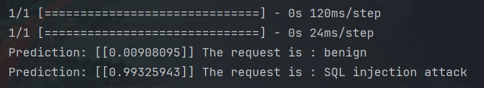

    
    
    

# SQL Injection Dataset

This respository hosts the training process and the creation of a model for SQL injections detection. 
The trained model is saved in a hdf5 file, which will be added to our API SUSHI, in order to prevent the Big Brain website from SQL injections.

# Linked projects

This work is linked to other works on following repositories:

- [Big Brain](https://github.com/ipsa-scrypt/big-brain)
- [SUSHI](https://github.com/ipsa-scrypt/sushi)

# Built with

The prediction model is built using the following technology:

- [Python](https://www.python.org/)

# Acknowledgements

- Professor Mauro Rodrigues
- [IPSA](https://www.ipsa.fr/) 👀
